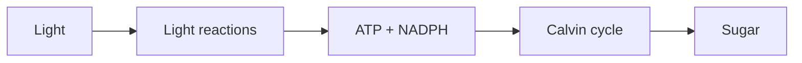

Text with an image:

```mermaid
flowchart LR
  accTitle: Light to sugar
  accDescr: Light energy drives the light reactions, which make ATP and NADPH for the Calvin cycle, which makes sugar.
  A[Light] --> B[Light reactions] --> C[ATP + NADPH] --> D[Calvin cycle] --> E[Sugar]
```
